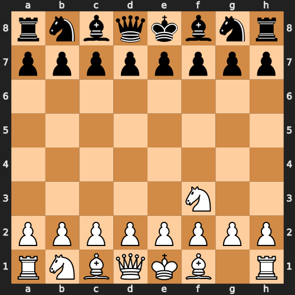
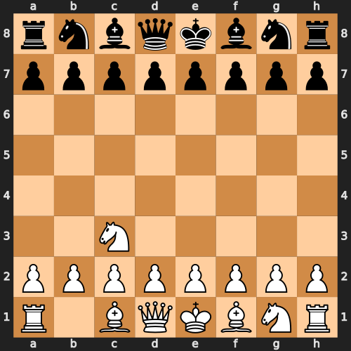

# Spring_2025_AI_Assignment_3

This repository contains the implementation of Minimax and Alpha-Beta Pruning algorithms applied to the game of Chess using the gym-chess environment. It also includes automated gameplay simulations, move-by-move board visualizations, and final game outcome reporting.

## Contributors:
- CS22B028 Johri Aniket Manish
- CS22B024 Harshit Garg

## How to Run

1. Clone the repository
```bash
git clone https://github.com/Error-404-NotFound/AI_Assignment_2.git
```
2. Go to the cloned repository
```bash
cd AI_Assignment_2
```
3. Ensure Python is installed
```bash
python --version # Output: Python 3.12.4
```
4. Create a virtual environment and activate it
```bash
python -m venv AI
```
> [!TIP]
> For Linux:
>```bash
>source AI/bin/activate
>```
>For Windows:
>```bash
>AI\Scripts\activate.bat
>```
5. Install Setuptools
```bash
pip install setuptools
```
6. Install dependencies
```bash
pip install -r requirements.txt
```
7. Run main.py
```bash
python play_chess.py --depth <k-ary tree depth> --algo <['minimax', 'alphabeta'] (default='alphabeta')> --player_color <['white', 'black'] (default='white')>
```
## Implemented Algorithms

- **Minimax**  
  A classic decision rule for minimizing the possible loss while maximizing the minimum gain. Used for perfect-information games like Chess.

- **Alpha-Beta Pruning** 
  An optimized version of Minimax that skips evaluating branches that cannot possibly influence the final decision, drastically reducing computation time.
  

## Environments

- **gym-chess**  
  A reinforcement learning environment built on the python-chess library that simulates legal chess gameplay. Used for AI vs AI simulations. [Chess](https://github.com/iamlucaswolf/gym-chess) environment is used for these algorithms.
 
## Project Structure

```bash
.
├── algorithms/
│   ├── __init__.py
│   ├── abpruning.py
│   └── minimax.py
├── .gitignore
├── agent.py
├── AI_Assignment_3.pptx
├── alphabeta_chess_game.gif
├── minimax_chess_game.gif
├── play_chess.py
├── README.md
├── requirements.txt
├── user_white_algo_alphabeta_depth_3.txt
├── user_white_algo_minimax_depth_3.txt
└── utils.py
```

## Visualizations

- **Minimax**  


- **Alpha-Beta Pruning**  


## algorithms/ – Core Algorithm Implementations

This directory contains the core logic for all the search and optimization algorithms implemented in the project. Each file corresponds to a specific algorithm or shared functionality.

### File Descriptions

- **`minimax.py`**  
  Implements the Minimax algorithm, a classical decision-making algorithm used in two-player turn-based games like Chess. It simulates all possible moves to a given depth, assuming both players play optimally, and chooses the move that maximizes the player's minimum gain. Best suited for small game trees or low depths due to its exhaustive nature.

- **`alphabeta.py`**  
  Implements the Alpha-Beta Pruning optimization over the Minimax algorithm. It avoids exploring branches that won't affect the final decision, dramatically reducing the number of nodes evaluated. This makes it more efficient and scalable to deeper search depths compared to plain Minimax.

- **`__init__.py`**  
  Makes the directory a Python package, allowing easy imports from `algorithms` in other parts of the codebase (e.g., `from algorithms.minimax import minimax`).

These game-playing algorithms are designed to work with the gym-chess environment and can be easily extended to other turn-based board games. They use evaluation functions to score board states and determine the most strategic moves for the AI.

## Conclusion

This project showcases the use of classical game-playing algorithms — Minimax and Alpha-Beta Pruning — in a complex environment like chess. Through strategic evaluations and search-tree optimizations, it emphasizes how intelligent decision-making can be modeled and improved through algorithmic design.

Whether you're simulating a full-depth minimax strategy or pruning unnecessary branches for speed, this repository serves as a hands-on resource for understanding and comparing:

- Exhaustive vs optimized game-tree exploration
- Trade-offs between accuracy and efficiency
- Impact of search depth and heuristics in adversarial settings

Feel free to explore, experiment, and build upon this project to deepen your understanding of AI in strategic game environments.

---

**Questions or Suggestions?**  
Open an issue or reach out via discussions!
